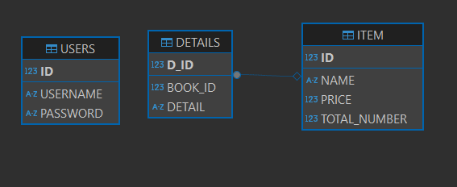

Who we are?

Backend DEV. :

hello my name is ziad muhammad nagah 
i'm 22 year's old beginner Backend programmer and java developer
i used servlet and JSP as a framework to program a MVC website using TomCat v9.0
and Oracle DB 19C for storing Models .

Description:

i made a MVC web application for a CRUD system with login/signup UI made with my friend.
i made 2 controlers (UserController to control Login/signup 
, ItemController to control CRUD system) 2 models (User to save users data throw login/signup page,
Item to save the item Data description ,name,price,total number (stock) with operation on them).
the main page is the table page(load-items.jsp)wich get the models of items and show them .
using the session if the user loged in even if he closed the tap of the site he will enter the page .
other wise he will be redirected to the login/signup page (welcome.jsp).the same to the signup/login page 
but in reverse way if you loged in before, you will be redirected to main page .

the ERD of the models :

Frontend DEV. :

My name is Ibrahim Mohammed This is my first project in web development. I worked as a front-end developer with an amazing back-end developer who helped me a lot, as I was still learning.
I worked on building the structure of the project using HTML and designing its style using CSS.
I learned a lot about teamwork and coordination with a co-worker.
